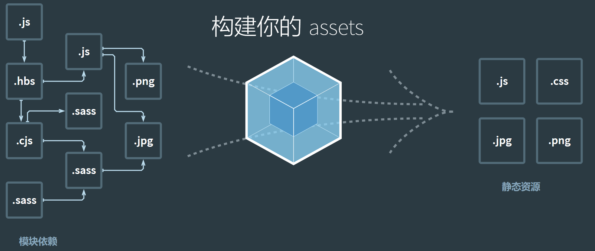

# npm 包管理器和 webpack 介绍

## npm 介绍

- npm 解决的核心问题是模块管理问题
- npm 包含 cli、模块仓库、官网三大部分

### npm 原理总结

- npm init 创建模块，npm install 安装模块，npm publish 发布模块
- npm link 本地开发，npm config 调整配置，npm run 调用 scripts
- npm 规范：package.json 管理模块信息，node_modules 保存依赖

### npm 的局限

- npm 只能解决模块的高效管理和获取问题
- npm 无法解决性能加载性能问题
- 模块化发明后，制约其广泛应用的因素就是性能问题

## webpack

### webpack 诞生背景

- webpack2012 年 3 月 10 号诞生，作者是 Tobias(德国)
- 移植了 GWT(Google Web Toolkit)的功能「code splitting]
- 2014 年 Instagram 团队分享性能优化时，提到使用 Webpack 的「code splitting」 特性
- webpack 的出现模糊了任务和构建的边界，使之融为一体

### webpack 的原理

- 最初的 webpack 核心解决的问题就是代码合并与拆分
- webpack 的核心理念是将资源都视为模块，统一进行打包和处理
- webpack 提供了 loader 和 plugins 完成功能扩展

