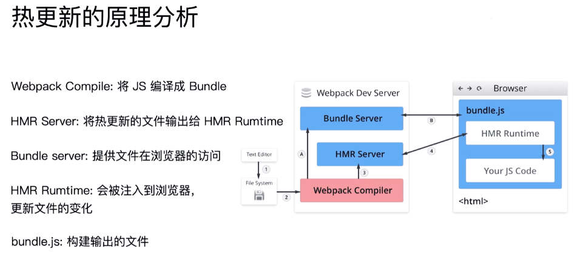

# webpack 基础知识

## entry 入口

entry 作为项目的入口，如果只有一个入口，entry 的值就可以直接是一个访问路径的字符串，多个入口则需要是一个对象，对象的 key 就是入口的名称，value 就是入口的访问路径。

## output 出口

output 作为项目的打包出口，有两个属性，一个是 path，一个是 filename。

- filename 是一个文件名，如果有多个入口，需要打包出多个文件的话，可以直接使用占位符[name]，其中 name 就是入口的名称。
- path 就是要输出的打包后的文件路径

## loaders

webpack 原生是只支持 js 和 json 文件的，loader 的作用就是将 webpack 识别不了的文件转换成 webpack 可以识别的文件，比如 less, sass, vue, jsx, ts, json 等等

### 常用的 loader

1. css-loader
2. style-loader
3. file-loader
4. babel-loader
5. ts-loader
6. thread-loader
7. raw-loader

### 用法

放在 webpack.config.js 文件中，module.rules 对象数组中添加需要的 loader,每一个项有两个属性，test 和 use，test 用来匹配需要处理的文件，use 用来指定使用哪个 loader

```js
const path = require("path");
module.exports = {
  output: { filename: "bundle.js" },
  module: { rules: [{ test: /^.txt$/, use: "raw-loader" }] },
};
```

## plugins

所有 loader 不能做的事情都可以做。

- 文件优化主要对一些打包体积的优化，做一些文件内容的处理，类如压缩，移动，增删等。作用域整个构建的过程中。
- 环境变量注入
- 资源管理

常见的插件：

1. html-webpack-plugin
2. clean-webpack-plugin
3. mini-css-extract-plugin
4. uglifyjs-webpack-plugin
5. bundle-analyzer
6. CommonsChunkPlugin 将 chunks 相同的模块代码提取成公共 js
7. CopyWebpackPlugin 将文件或者文件夹拷贝到构建的输出目录
8. ZipWebpackPlugin 将打包出的资源生成一个 zip 包

## 解析 ES6 模块 和 react/vue 的 语法

- babel-core
- babel-loader
- babel-preset-env
- babel-preset-react
- babel-preset-vue

## 解析 css,less,scss

- style-loader 将样式通过使用 style 标签插入到 head 中，这个插入过程是使用 js 来进行操作的，样式可以是被提取出来的 css,也可以是在 js 中的，主要在于是否将 css 提取出来
- css-loader 将 css 转换成 commonjs 模块
- less-loader 将 less 转换成 css
- sass-loader 将 sass 转换成 css

## 解析图片，字体等文件

- file-loader 一般的文件都可以使用 file-loader 来解析
- url-loader 可以将图片转换成 base64，设置 limit 属性，如果图片大小小于这个值，就会将图片转换成 base64，否则就会使用 file-loader 来解析。**url-loader 里面封装了 file-loader**

- pdf-loader 让 pdf 文件可以正常显示

## 文件监听

文件监听是指：当文件发生改变的时候，会自动重新编译打包输出编译后的结果，但是不会自动刷新页面。需要手动刷新页面。

webpack 开启监听模式，有两种方式：

- 启动 webpack 命令时，带上--watch 参数
- 在配置 webpack.config.js 中设置 watch:true

```txt
"script": "webpack --watch"
```

```js
//更细致的配置
module.export = {
  //默认false，也就是不开启
  watch: true,
  //只有开启监听模式时，watchOptions才有意义
  watchOptions: {
    //默认为空，不监听的文件或者文件夹，支持正则匹配
    ignored: /node_modules/,
    //监听到变化发生后会等300ms再去执行，默认300ms
    aggregateTimeout: 300,
    //判断文件是否发生变化是通过不停询问系统指定文件有没有变化实现的，默认每秒问1000次
    poll: 1000,
  },
};
```

## 热更新

热更新是指：当文件发生改变的时候，会自动重新编译打包输出编译后的结果，并且会自动刷新页面。

需要使用：

- webpack-dev-server
- 内置插件 hot-module-replacement-plugin

```js

module.exports = {
  // ...省略其他配置
  mode:  "development",
  plugins: [
    new webpack.HotModuleReplacementPlugin()
  ]
  devServer: {
    // 告诉服务器从哪里提供热更新内容
    contentBase: path.join(__dirname, "dist"),
    hot: true,
  }
}
```

其他方式：

- webpack-dev-middleware 配合 express/koa 等自己写服务更加灵活

### 热更新原理

一般通知浏览器更新是 websocket


- 开发服务启动打包阶段：1-->2，A-->B
- 文件修改：3-->4

## 文件指纹

- hash 是整个项目的 hash
- chunkhash 和打包的 chunk 有关，不同的 entry 会生成不同的 hash。一般 js 使用
- contenthash 文件内容 hash，一般 css, 图片使用

占位符分类：

- [name] 占位符，文件名
- [hash] 占位符，hash 值
- [ext] 占位符，文件后缀
- [contenthash] 占位符，文件内容 hash
- [chunkhash] 占位符，chunk 的 hash 值
- [folder] 占位符，文件所在目录
- [path] 占位符，文件路径

注意提取 css 的时候，如果使用 mini-css-extract-plugin，那么 style-loader 就不能使用，可以替换成 mini-css-extract-plugin.loader。

21
