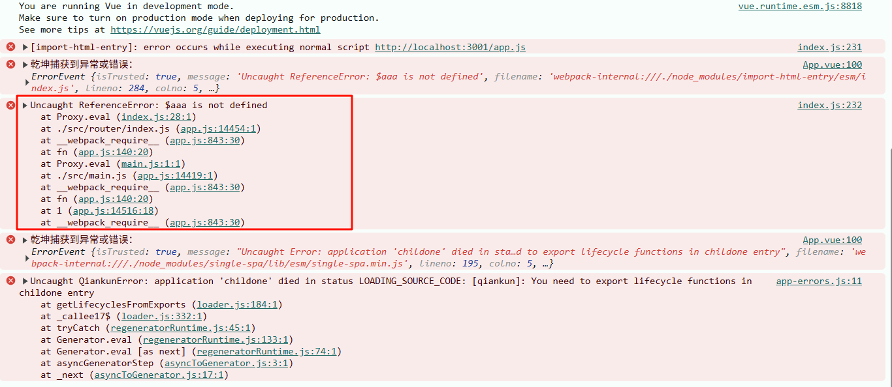
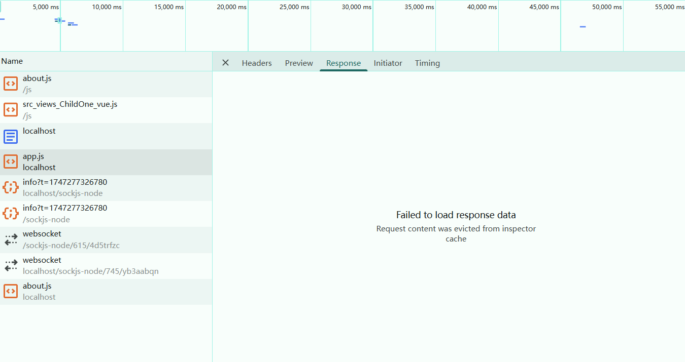
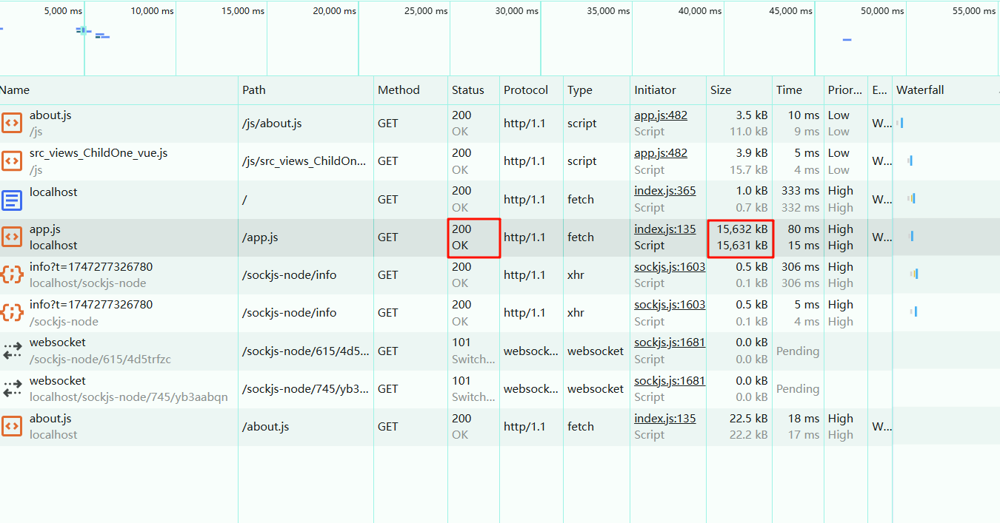

# 两年没动过的项目给我，studio 得用微前端集成之 qiankun 集成 Vue2 微应用遇到的各种问题整理

产品把两年没动过的项目丢给你，说用 qiankun 把它当微应用集成到主应用中，给你集，你集不集？Looking my eyes! 反正我 studio 得集。Tell me why, baby why?

本文记录了一些自己在使用 qiankun 集成老旧 Vue2 微应用过程中遇到的问题，这里整理一下，会提供解决方案，错误分析，由于是公司的代码，我会比较少贴真实代码，有的问题会贴一个自己的 demo，尽量文字描述清楚。在这个过程中我还是成长了不少，话不多说，直接进入正文。

## 有些依赖版本过低启动不起来

集成的是一个相对比较老的系统，大概有两年代码没有改动过了，还没有 lock文件。。。而很多包都是只锁的主版本，非常容易发生依赖版本过低启动不起来的问题。

查看控制台报错是因为一个组件加载出错，查看错误栈，是一个 less-loader 的问题，而这个 less-loader 是包含在 vue-template-compiler 里面的，所以需要更新一下 vue-template-compiler 的版本，然后重新安装一下依赖。

我是直接锁了 vue-template-compiler 的版本到 2.6.10，相应地把 vue 的版本也给锁了2.6.10。然后重新 npm install 就可以了。

## hash 路由改为 history 路由

把路由的 mode 改成 history，因为 qiankun 官方是推荐使用 history 路由模式的。

一些相对路径要改成绝对路径，比如说，在 index.html 中直接导入的文件，还有webpack 的 publicPath 也要改成绝对路径，这个 publicPath 是我们打包后放静态资源的路径。

## 集成后子应用的代码找不到子应用的全局变量，是undefined？

我们项目中是在 index.html 里面导入了一个config.js，然后作用是配置一些全局变量，必须要先执行，然后直接在 head 中导入的。例如：

```html
<!-- index.html 引入config.js -->
<script src="/config.js"></script>
```

```js
var $aaa= 'xxx'
```

但是在主应用中加载子应用的时候，这个子应用里面的config.js 文件能加载出来，但是控制台却报警告找不到里面定义的全局变量。报错警告如下：


分析一下这个报错，就是找不到变量 $aaa，错误栈里面就可以看到有一个Proxy.eval()，这个方法会去执行字符串，去执行我们的 config.js 里面的文件。

就是使用eval()，来执行的我们的代码，现在问题变成了 一个八股问题 eval执行的代码里的作用域问题，其实就是简单一句话，作用域是根据eval所执行的代码的作用域，是和eval的作用域一致的，是会变的。

我们知道 var 声明的变量是有函数作用域的，那么如果说 import-html-entry 在执行的时候是在函数里面执行的，那么我们在config.js 中定义的变量，就会变成局部作用域，其他地方当然会无法访问到。事实就是这样。

解决方式是：去掉变量声明或者挂到 window 对象中：

```patch
-- var $aaa = 'xxx'
++ $aaa = 'xxx'
## 或者改为：
++ window.$aaa = 'xxx'
```

为什么这两种方式会生效呢，因为这两种方式都可以将变量挂到 window 对象中，而 qiankun 会对子应用的 window 对象进行代理，所以会生效。

## 开发环境中，主应用中的子应用的网络请求不对

就是在开发环境中，子应用可以在主应用中正常访问，但是网络请求不对，用浏览器看了一下是没有走子应用的代理。

但是我们明明是在子应用本地服务，配了devServer的代理，为什么主应用访问不到子应用的代理呢？

原因的话其实是，子应用现在其实是跑在主应用里面，所以访问的时候会直接走主应用的代理，子应用是劫取不到代理的，所以就没有生效。

解决方法的话就是在主应用里面加上子应用的代理。

> 需要注意的是，不能和主应用其他的代理相冲突，就算是有一部分开头一样也不行，因为代理配置一般是正则匹配，匹配以 xx 开头的，只要匹配到第一个，那么后面的就不会匹配了。

小技巧：在配置代理的时候可以，在 proxy 里面每个代理配置中配置一个 debug 选择项，这样每次网络请求的时候就会在控制台打印出请求的代理日志，这样方便观察代理结果和调试。例如：

```patch
devServer: {
  port: 3000,
  proxy: {
    '/api': {
      target: process.env.VUE_APP_REQUEST_URL,
      changeOrigin: true,
      pathRewrite: {
        '^/api': '',
      },
++    logLevel: 'debug',
    },
  }
}
```

## 开发中 浏览器里面app.js Response选项卡显示加载失败

报错信息：


可能有人会问，我的项目里面根本就没有这个app.js，怎么会加载这个？

先说一下这个app.js 是从哪里来的，细心的小伙伴如果日常开发中有留意的话，就会知道这个是 Vue 项目在开发环境下自动注入到 index.html 的，而主应用通过 import-html-entry 这个包加载子应用的静态资源的时候就会加载这个app.js文件

回过头来，看一下这个问题，翻译一下这个警告信息就是：

> 加载响应数据失败，请求内容被 从inspector 缓存中移除。

其实这个警告常见于请求的内容过大导致触发了浏览器的缓存清除机制，清除了一部分请求的内容，从而导致浏览器解析显示失败。为了验证这一点我们可以看一下这个app.js的状态码和文件大小。


可以看出来这个 app.js 的大小差不多有 15MB，（我们公司的那个项目 app.js 大概有29MB。。。），状态码是200，虽然这个文件内容过大，但是确实是请求和加载成功了的。

结论是，这个错误不必要管，因为这个文件是请求和加载成功，不影响正常功能，所以可以忽略。

> 至于为什么 app.js 这么大，因为这是开发环境，app.js 里面包含了很多第三方库之类的，webpack的注入的内容，而且还没有压缩，自然就很大。

## 路由的访问是为空，但是也没有报错

基本上就是因为注册的 activeRule 配置和子应用的 history 的 base 路径不一致导致的。

如果说子应用需要独立配置的话，可以通过乾坤的 mounted 子应用生命周期钩子把 base 路径传给子应用，然后在子应用中更改router的base路径，不用重新new一个router实例。可以直接改，例如：

```javascript
// src/main.js
// router 是history模式的路由实例，state 是主应用传递过来的数据对象，baseUrl 是其中的属性
router.history.base = state.baseUrl;
router.options.base = state.baseUrl;
```

如果约定好了确定不会变，也可以不用通过主应用传递过来，直接在主应用写死activeRule，子应用写死路由 base 即可，这里不再赘述。

## 总结

本文总结自己在使用 qiankun 集成微应用中遇到的问题，分析了原因，以及提供了解决方法。如果后续遇到其他 qiankun 集成相关问题，这篇文章应该会持续更新，大家可以点赞收藏一波，更多优质文章，请持续关注哦。

最后，我们项目是通过主应用传递 token 和 路由菜单给微应用的，有兴趣的话，可以评论留言，一起讨论，必要的话我可以再写一篇文章说明。
