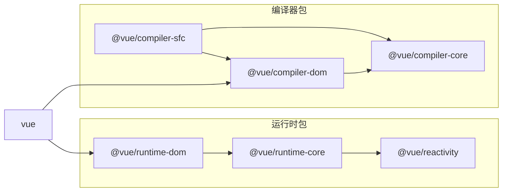

# Vue.js 贡献指南

你好！非常感谢你对参与 Vue.js 开发感兴趣。在提交你的贡献之前，请花一点时间阅读以下指南：

- [行为准则](https://vuejs.org/about/coc.html)
- [问题报告指南](#问题报告指南)
- [拉取请求指南](#拉取请求指南)
- [开发环境搭建](#开发环境搭建)
- [脚本命令](#脚本命令)
- [项目结构](#项目结构)
- [测试贡献](#测试贡献)

## 问题报告指南

- 请始终使用 [https://new-issue.vuejs.org/](https://new-issue.vuejs.org/) 创建新问题。

## 拉取请求指南

### 哪些类型的拉取请求会被接受？

- **修复明确识别的 bug**。所谓“明确识别的 bug”，是指该 bug 已经在某个公开 issue 中被清晰复现，或者 PR 本身包含了可复现的示例。请避免提交那些声称修复了某些问题但没有充分说明具体修复内容的 PR。

- **新增功能需解决一个清晰且广泛适用的使用场景**。“广泛适用”意味着该功能应对大多数用户带来非平凡的改进。Vue 的 API 表面已经很大，因此我们对新增功能持谨慎态度——如果某个用例较为小众，并且可以通过用户空间（userland）实现解决，那么它很可能不适合加入核心。

  功能实现还应权衡新增复杂性与所获收益之间的关系。例如，如果一个小功能需要在整个代码库中进行大量改动，那可能就不值得，或者需要重新考虑实现方式。

  如果该功能涉及非平凡的 API 新增，或显著影响用户处理常见用例的方式，则应先在 [RFC 仓库](https://github.com/vuejs/rfcs/discussions) 中进行讨论。未经事先讨论就提交此类功能的 PR，会因实现与具体代码耦合而难以调整 API 设计，可能导致工作白费。

- **杂项（chore）**：拼写错误、注释优化、构建配置、CI 配置等。对于拼写和注释类修改，请尽量将多个小修改合并到一个 PR 中。

- **请注意：我们不鼓励提交主要是风格层面的代码重构**。只有当重构能提升性能，或能充分说明其客观上提升了代码质量（例如使相关功能实现更容易）时，才会被接受。

  原因在于代码可读性具有主观性。本项目的维护者基于自身偏好选择了当前的代码风格，我们不希望花费时间解释这些风格偏好。贡献者在提交代码时应尊重已有的约定。

  此外，大规模的风格变更会产生涉及多个文件的巨大 diff，给 Git 历史带来噪音，使得日后追踪行为变更变得更加困难。

### 拉取请求检查清单

- Vue 核心有两个主要工作分支：`main` 和 `minor`。
  - 如果你的 PR 是新增 API 功能，应提交到 `minor` 分支。
  - 其他情况应提交到 `main` 分支。

- [请务必勾选 “Allow edits from maintainers”（允许维护者编辑）选项](https://docs.github.com/en/pull-requests/collaborating-with-pull-requests/working-with-forks/allowing-changes-to-a-pull-request-branch-created-from-a-fork)。这允许我们直接进行小幅编辑或重构，节省大量时间。

- 如果是新增功能：
  - 添加相应的测试用例。
  - 提供令人信服的理由说明为何要添加此功能。理想情况下，应先提交一个建议 issue 并获得批准后再开始开发。

- 如果是修复 bug：
  - 如果你正在解决某个特定 issue，请在 PR 标题中加上 `(fix #xxxx[,#xxxx])`（其中 #xxxx 是 issue 编号），以便生成更好的发布日志，例如：`update entities encoding/decoding (fix #3899)`。
  - 在 PR 中详细描述 bug。最好提供在线演示。
  - 如适用，请添加适当的测试覆盖。你可以通过运行 `nr test-coverage` 检查你的代码覆盖率。

- 在开发过程中保留多个小 commit 是可以的——GitHub 可以在合并前自动 squash 它们。

- 确保所有测试通过！

- 提交信息必须遵循 [提交信息规范](./commit-convention.md)，以便自动生成 changelog。每次提交前会自动验证提交信息格式（通过 [simple-git-hooks](https://github.com/toplenboren/simple-git-hooks) 调用 [Git Hooks](https://git-scm.com/docs/githooks)）。

- 无需担心代码风格，只要你安装了开发依赖——在提交时，修改的文件会通过 Prettier 自动格式化（同样由 simple-git-hooks 触发）。

### 高级拉取请求建议

- PR 应**仅**修复目标 bug，不应引入无关更改。这包括不必要的重构——PR 应聚焦于修复本身，而非代码风格，这样便于未来追踪变更。

- 考虑更改对性能/体积的影响，以及所修复的 bug 是否值得付出这些代价。如果修复的是非常边缘的小众场景，应尽量减少体积/性能开销。

  - 代码是否处于性能敏感路径（例如组件更新或虚拟 DOM patch 函数）？
    - 如果是仅用于开发环境的分支，性能影响较小。

  - 检查更改引入了多少额外的打包体积：
    - 确保将仅用于开发环境的代码放在 `__DEV__` 分支中，以便 tree-shaking。
    - 运行时代码比编译器代码对体积更敏感。
    - 确保不会意外地将仅用于开发或编译器的代码包含进运行时构建中。特别注意：`@vue/shared` 中的一些函数（如 `isHTMLTag` 和 `isSVGTag`）仅用于编译器，不应在运行时代码中使用。

## 开发环境搭建

你需要安装 [Node.js](https://nodejs.org)，版本不低于项目根目录下 [`.node-version`](https://github.com/vuejs/core/blob/main/.node-version) 文件中指定的版本，以及 [PNPM](https://pnpm.io)，版本不低于 [`package.json`](https://github.com/vuejs/core/blob/main/package.json#L4) 中 `"packageManager"` 字段指定的版本。

我们也推荐安装 [@antfu/ni](https://github.com/antfu/ni)，它可以帮助你在使用不同包管理器的项目之间切换。`ni` 还提供了便捷的 `nr` 命令，用于更轻松地运行 npm 脚本。

克隆仓库后，运行：

```bash
pnpm i # 安装项目依赖
```

主要工具概览：

- 使用 [TypeScript](https://www.typescriptlang.org/) 作为开发语言
- 使用 [Vite](https://vitejs.dev/) 和 [ESBuild](https://esbuild.github.io/) 进行开发构建
- 使用 [Rollup](https://rollupjs.org) 进行生产构建
- 使用 [Vitest](https://vitest.dev/) 进行单元测试
- 使用 [Prettier](https://prettier.io/) 进行代码格式化
- 使用 [ESLint](https://eslint.org/) 进行静态错误检查（类型系统之外）

## Git Hooks

项目使用 [simple-git-hooks](https://github.com/toplenboren/simple-git-hooks) 在每次提交时强制执行以下操作：

- 对整个项目进行类型检查
- 使用 Prettier 自动格式化已修改的文件
- 验证提交信息格式（逻辑位于 `scripts/verify-commit.js`）

## 脚本命令

**以下示例将使用 [@antfu/ni](https://github.com/antfu/ni) 包提供的 `nr` 命令**。你也可以使用普通的 `npm run`，但需要在命令后加 `--` 再传递参数。例如，`nr build runtime --all` 等价于 `npm run build -- runtime --all`。

部分脚本中使用的 `run-s` 和 `run-p` 命令来自 [npm-run-all](https://github.com/mysticatea/npm-run-all)，用于协调多个脚本：`run-s` 表示“顺序执行”，`run-p` 表示“并行执行”。

- [Vue.js 贡献指南](#vuejs-贡献指南)
  - [问题报告指南](#问题报告指南)
  - [拉取请求指南](#拉取请求指南)
    - [哪些类型的拉取请求会被接受？](#哪些类型的拉取请求会被接受)
    - [拉取请求检查清单](#拉取请求检查清单)
    - [高级拉取请求建议](#高级拉取请求建议)
  - [开发环境搭建](#开发环境搭建)
  - [Git Hooks](#git-hooks)
  - [脚本命令](#脚本命令)
    - [`nr build`](#nr-build)
      - [构建格式](#构建格式)
      - [生成 Source Map](#生成-source-map)
    - [`nr build-dts`](#nr-build-dts)
    - [`nr check`](#nr-check)
    - [`nr dev`](#nr-dev)
    - [`nr dev-sfc`](#nr-dev-sfc)
    - [`nr dev-esm`](#nr-dev-esm)
    - [`nr dev-compiler`](#nr-dev-compiler)
    - [`nr test`](#nr-test)
    - [`nr test-dts`](#nr-test-dts)
  - [项目结构](#项目结构)
    - [包导入方式](#包导入方式)
    - [包依赖关系](#包依赖关系)
  - [测试贡献](#测试贡献)
    - [测试类型定义正确性](#测试类型定义正确性)

### `nr build`

`build` 脚本会构建所有公共包（即 `package.json` 中未设置 `private: true` 的包）。

可通过模糊匹配指定要构建的包：

```bash
# 仅构建 runtime-core
nr build runtime-core

# 构建所有名称匹配 "runtime" 的包
nr build runtime --all
```

注意：`nr build` 使用 `rollup-plugin-esbuild` 编译 TypeScript，**不会执行类型检查**。要对整个代码库进行类型检查，请运行 `nr check`。类型检查也会在每次提交时自动运行。

#### 构建格式

默认情况下，每个包会按其 `package.json` 中 `buildOptions.formats` 字段指定的多种分发格式进行构建。可通过 `-f` 标志覆盖。支持的格式包括：

- **`global`**
- **`esm-bundler`**
- **`esm-browser`**
- **`cjs`**

主 `vue` 包额外支持以下格式：

- **`global-runtime`**
- **`esm-bundler-runtime`**
- **`esm-browser-runtime`**

更多细节请参见 [`vue` 包的 README](https://github.com/vuejs/core/blob/main/packages/vue/README.md#which-dist-file-to-use) 和 [Rollup 配置文件](https://github.com/vuejs/core/blob/main/rollup.config.js)。

例如，仅以 global 格式构建 `runtime-core`：

```bash
nr build runtime-core -f global
```

可通过逗号分隔指定多个格式：

```bash
nr build runtime-core -f esm-browser,cjs
```

#### 生成 Source Map

使用 `--sourcemap` 或 `-s` 标志可生成 source map。注意这会显著减慢构建速度。

### `nr build-dts`

该命令为所有包生成类型声明文件。首先在 `temp` 目录中生成原始 `.d.ts` 文件，然后使用 [rollup-plugin-dts](https://github.com/Swatinem/rollup-plugin-dts) 将类型合并为每个包的单个 `.d.ts` 文件。

### `nr check`

（略）

### `nr dev`

`dev` 脚本以开发模式构建指定包（默认为 `vue`），使用指定格式（默认为 `global`），并监听文件变化。当你想在 HTML 页面中快速调试构建结果时非常有用：

```bash
$ nr dev

> built: packages/vue/dist/vue.global.js
```

- **重要提示**：`dev` 脚本的输出**仅用于开发和调试**。尽管其运行时行为相同，但生成的代码绝不应发布到 npm。

- `dev` 脚本**不支持模糊匹配**——必须指定完整包名，例如 `nr dev runtime-core`。

- 支持通过 `-f` 标志指定构建格式（同 `build` 脚本）。

- 支持 `-s` 标志生成 source map，但会减慢重建速度。

- 支持 `-i` 标志内联所有依赖。这对于调试默认 externalize 依赖的 `esm-bundler` 构建很有用。

### `nr dev-sfc`

启动本地 SFC Playground 的快捷方式。当你能在 SFC Playground 中复现问题时，这是最快的调试反馈循环。

### `nr dev-esm`

使用 esbuild 构建并监听 `vue/dist/vue-runtime.esm-bundler.js`，同时内联所有依赖。当你需要在真实构建环境中调试 ESM 构建时很有用：先全局链接 `packages/vue`，再将其链接到待调试的项目中。

### `nr dev-compiler`

`dev-compiler` 脚本构建、监听并在 `http://localhost:3000` 启动 [Template Explorer](https://github.com/vuejs/core/tree/main/packages/template-explorer)。当你处理纯编译器问题时非常有用。

### `nr test`

`test` 脚本直接调用 `vitest` 二进制文件，因此所有 [Vitest CLI 选项](https://vitest.dev/guide/cli.html#options) 都可用。例如：

```bash
# 以监听模式运行所有测试
$ nr test

# 运行一次后退出（等价于 `vitest run`）
$ nr test run

# 运行 runtime-core 包下的所有测试
$ nr test runtime-core

# 运行文件名匹配模式的测试
$ nr test <fileNamePattern>

# 在特定文件中运行指定名称的测试
$ nr test <fileNamePattern> -t 'test name'
```

针对源码的测试归为 `nr test-unit`，而针对在真实浏览器中运行的构建产物的测试归为 `nr test-e2e`。

### `nr test-dts`

先运行 `nr build-dts`，然后验证 `packages-private/dts-test` 中的类型测试是否能正确通过实际生成的类型声明文件。

## 项目结构

本仓库采用 [monorepo](https://en.wikipedia.org/wiki/Monorepo) 结构，在 `packages` 目录下托管多个关联包：

- `reactivity`：响应式系统。可作为独立的框架无关包使用。

- `runtime-core`：平台无关的运行时核心。包含虚拟 DOM 渲染器、组件实现和 JavaScript API。可基于此包创建面向特定平台的高级运行时（即自定义渲染器）。

- `runtime-dom`：面向浏览器的运行时。包含原生 DOM API、属性、特性、事件处理器等处理逻辑。

- `runtime-test`：轻量级测试运行时。可在任意 JavaScript 环境中使用，因为它将组件“渲染”为普通 JavaScript 对象树。该树可用于断言正确的渲染输出，还提供序列化树、触发事件和记录节点操作的工具。

- `server-renderer`：服务端渲染包。

- `compiler-core`：平台无关的编译器核心。包含可扩展的编译器基础和所有平台无关插件。

- `compiler-dom`：包含专门面向浏览器的额外插件的编译器。

- `compiler-sfc`：用于编译 Vue 单文件组件（SFC）的底层工具。

- `compiler-ssr`：生成针对服务端渲染优化的渲染函数的编译器。

- `shared`：多个包共享的内部工具（尤其是运行时和编译器共用的环境无关工具）。

- `vue`：面向公众的“完整构建”，同时包含运行时和编译器。

- 私有工具包：
  - `dts-test`：包含针对生成的 dts 文件的纯类型测试。
  - `sfc-playground`：持续部署在 <https://play.vuejs.org> 的 playground。本地运行请使用 [`nr dev-sfc`](#nr-dev-sfc)。
  - `template-explorer`：用于调试编译器输出的开发工具，持续部署在 <https://template-explorer.vuejs.org/。本地运行请使用> [`nr dev-compiler`](#nr-dev-compiler)。

### 包导入方式

各包可直接通过包名相互导入。注意导入时应使用其 `package.json` 中列出的名称，通常需要 `@vue/` 前缀：

```js
import { h } from '@vue/runtime-core'
```

这得益于以下配置：

- TypeScript：`tsconfig.json` 中的 `compilerOptions.paths`
- Vitest 和 Rollup：共享来自 `scripts/aliases.js` 的别名配置
- 普通 Node.js：通过 [PNPM Workspaces](https://pnpm.io/workspaces) 链接

### 包依赖关系



跨包导入时需遵守以下规则：

- **禁止使用相对路径直接导入其他包的内容**——应在源包中导出，然后在包级别导入。
- **编译器包不得导入运行时包的内容，反之亦然**。若需在编译器和运行时之间共享内容，应提取到 `@vue/shared`。
- 若包 A 非类型地导入或重新导出包 B 的类型，则应在 A 的 `package.json` 中将 B 列为依赖。因为在 ESM-bundler/CJS 构建和类型声明文件中，这些包会被 externalize，因此使用者必须实际安装这些依赖包。

## 测试贡献

单元测试与被测代码位于同一包内的 `__tests__` 目录中。请参考 [Vitest 文档](https://vitest.dev/api/) 和现有测试用例了解如何编写新测试。以下是一些额外指南：

- **使用测试所需的最小 API**。例如，如果测试无需涉及响应式系统或组件，就应避免使用它们。这能减少测试受无关变更影响的可能性，提高稳定性。
- **测试平台无关行为或断言底层虚拟 DOM 操作时，请使用 `@vue/runtime-test`**。
- **仅在测试平台特定行为时才使用平台特定的运行时**。

测试覆盖率持续部署在 <https://coverage.vuejs.org。欢迎提交提升覆盖率的> PR，但覆盖率应主要用于发现尚未覆盖的 API 使用场景。我们不建议添加仅提升覆盖率但无实际意义的测试。

### 测试类型定义正确性

类型测试位于 `packages-private/dts-test` 目录。运行 `nr test-dts` 即可执行类型测试（该脚本会先构建所有相关的 `*.d.ts` 文件）。一旦类型文件构建完成并保持最新，可通过 `nr test-dts-only` 重新运行测试。
