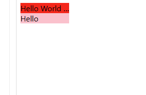

# 10 行代码，实现一个简单的 Vue 自定义指令——文本溢出显示省略号并添加 title，附带在线运行示例

Vue 的自定义指令，可以给元素添加一些自定义的属性，从而实现一些特殊的功能。比较知名的的自定义指令，比如图片懒加载，大屏项目用到的等比缩放，等等。

听起来比较有点复杂，但是其实只要实际用起来，上手还是比较快的。下面就使用大概 10 行代码，写一个文本溢出显示省略号并添加 title 的指令，快速领略自定义指令的强大。

想要实现的效果就是：在一个固定宽度的容器内，如果文本超出容器宽度，则显示省略号，并且鼠标移入文本时，要用 title 显示完整的文本。如果没有超出，则不显示省略号，也不用显示title。



Vue3 代码，[在线预览地址](https://play.vuejs.org/#eNqlVd1uE0cUfpVhL9hYMjZR2xtjR2qrSLQqpSpI3OzNZndsDxnPrGbHdiLLUto0hAIRVAREgfxcpD9CBatqS9I6cV5md+1c8Qo9M7trr9MSIWGtvDNzzvnO3zdnO8bHnldoNbFRMsq+I4gnkY9l05uzGGl4XEjUQQJXURdVBW8gE1RNi1nM4cyXqOHXUEXJZ8zLmFKObnBBXVQ//Ttn5jIms1M2E5Hv2ezKBJEwShjWpyg42Bhu7kSPboeP7rzPM3G2QLmzeG3aY3yYeDx8mnh8uDN+lHkK0JqnlHg+8cG6YzGEGrzJJHZLaAbT/AJhLmG1fItxF+dQZS7WQSg2Flg5LWp/xVhQLKJw7XXQf3zSfzJ6tXeytZ2EE66tDv/cfXN4L7zfG60eBX/vQGzh3u8QGxxGvc3w52+RnceNvC8FZzUU7a4PXw5ANjr+8WQdzF5ET3rR3eO0lIPg4EUwuBu+fKDs7z8IBs+ila3Rfk/52PslfPU6XNsPjh5Gq2vhrb/idXj7VrSt9ff74Z3d4bOD8J/N4dPvTlb6o8EP4cYfEFycB6nO6KQLctnDqFKpmMqtef48OgdZFyT2JRSo4Mtligsu8T1qL+dySXXi+nCQtG3BZiwjBNffb4xJAIn8pypaI7q3HvT3QGPctzeH31gG9CuGFUBqAb1T6278GgfBW1hUKW9DR8w6cV3MgOJTGhIvyasZLeCtbv1pvXadSAykciBxZDLeFraX6EBZQM2hBDN5g7iyXtZmjuCU6v2kBAl3Ci2bNjGCwilLSSRVqFPCXLEIzY+2n6vEj46Hm78mYuhMuHKo2gWdf7wePf8NTka9LSAPNCro/xRrAy5hDIvL1698kakN/MFTLsYDAUYBbCRuQKckhh1CZZe0kE65YhkLtrNYE0B+94LDKRclgd1LbZVSafbiRW/JMlDrQlqxigkDwJzrdPTs6HbLRYB6B0yPsMWzQWdT1NlpWE2dt+IuqxHUziJfOgWdTCWFniwVvFq+Cz4XNqvhFP8jhZ9wvqR5fMpZdiopj9l9xm25mGmHkTekD9emSmqFmz5nMMo1lSzD4Q2PUCyuepLAtbKMUjqFLMNWeX+uz6Ro4nx67tSxs/g/5zd9qHkJFl8J7GPRwpYxlklb1LCMxfPXvoTLkhE2uNukoH2G8GsMV76pYozVPoH6QdgZPR3tZ/qDBOy+7s8vScz8NCkVqOat1rcM+Eh9ekbqk3A/KHyY8t3o/gvBaujy)

```vue
<template>
  <div style="background-color:red;width:100px" v-ellipsis='msg'>{{ msg }}</div>
  <div style="background-color:pink;width:100px" v-ellipsis='msg1'>{{ msg1 }}</div>
  <span style="background-color:yellow;width:100px;" v-ellipsis='spanMsg'>{{spanMsg}}</span>
  <span style="background-color:orange;width:150px;display:block" v-ellipsis='blockSpanMsg'>{{blockSpanMsg}}</span>
</template>

<script setup>
import { ref } from 'vue'

const msg = ref('Hello World hhhhhhhhhhhhhhhhh!')
const msg1 = ref('Hello')
const spanMsg = ref('inline span 不生效啊啊啊啊啊啊啊啊啊啊啊啊啊啊啊啊啊啊啊啊啊')
const blockSpanMsg = ref(' block span 会生效哟哟哟哟')

const vEllipsis = {
  mounted: (el, binding, vnode) => {
    const reg = /block/
    // 其他默认非 block 元素，可能也会失效，比如 a,em,strong 标签，这里只是拿 span 举个例子，提供思路，大家具体情况具体分析，添加相应的逻辑即可
    if(vnode.type ==='span'&& !reg.test(el.style.display)){
      console.warn("当前 span 不是 block 元素，当前指令不会生效！")
      return
    }
    el.style.overflow = 'hidden'
    el.style.textOverflow = 'ellipsis'
    el.style.whiteSpace = 'nowrap'
    if(el.clientWidth< el.scrollWidth){
      binding.value && (el.title = binding.value)//如果不使用binding的值，是文本的话也可以使用el.innerHTML
    }
  }
}
</script>
```

Vue2 的代码:

```js
directives: {
  ellipsis: {
    inserted(el, binding, vnode) {
      const reg = /block/
      // 其他默认非 block 元素，可能也会失效，比如 a,em,strong 标签，这里只是拿 span 举个例子，提供思路，大家具体情况具体分析，添加相应的逻辑即可
      if(vnode.type ==='span'&& !reg.test(el.style.display)){
        console.warn("当前 span 不是 block 元素，当前指令不会生效！")
        return
      }
      el.style.overflow = 'hidden'
      el.style.textOverflow = 'ellipsis'
      el.style.whiteSpace = 'nowrap'
      if(el.clientWidth< el.scrollWidth){
        binding.value && (el.title = binding.value)//如果不使用binding的值，是文本的话也可以使用el.innerHTML
      }
    }
  }
},
```
