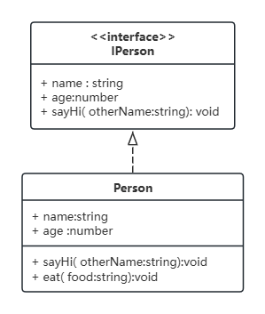
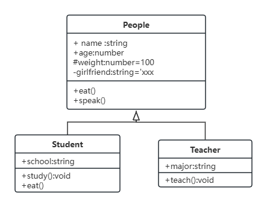
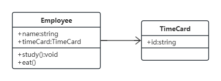
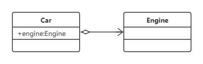
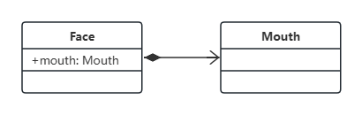
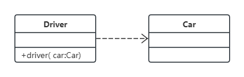

# UML 类图

<!-- markdownlint-disable -->

## UML 是什么

统一建模语言 Unified Modeling Language
软件设计的绘图标准
UML 不仅有类图，很多种图，这里主要介绍类图

## 画图工具

网站 ProcessOn

## 类图

三个区域：名称，属性，方法

权限描述 `+`表示 public，`#`表示 protected，`-`表示 private
| 
类图
|
|-----------------------------------------------------------------------------------------------|
| + public 属性名：type=defaultValue # protected 属性名: type - private 属性名: type |
| + public 方法名(a: type, b: type): returnType # protected 方法名(a: type) - private 方法名(a: type) |

## 实现

空三角箭头，虚线

## 泛化

空三角箭头，实线

## 关联

一个类与另一个类有关系，普通箭头，实线。可细分为聚合、组合、依赖（这三种了解即可）

### 聚合

整体包含部分，部分可以脱离整体而存在

### 组合

整体包含部分，部分不可以脱离整体

### 依赖

不是属性关系，而是函数参数或返回值

