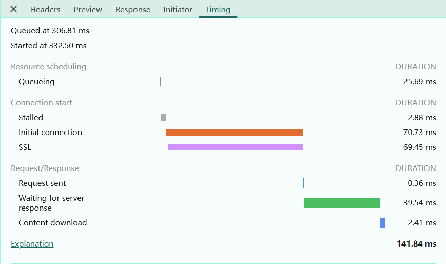

# 网络层面优化

## 由资源文件请求的时间线 Timing 分析

### 例子

一个文件请求的时间线例如：

Queuing 就是排队时间，造成排队的原因：

- 资源优先级，比如html,css,js的优先级高于图片
- http 1.1 浏览器为每个域名最多维护6个TCP连接
- 发请求的时候正在进行磁盘空间分配

Stalled 就是请求被挂起或者说停滞

Initial connection 就是建立连接的时间

SSL 就是 SSL握手时间

Request time 就是请求时间

Waiting for server response 就是等待响应的时间

Content download 就是下载内容时间

### 优化思路

解决排队时间就是：

- 域名分片技术，一个站点使用多个域名，那样就可以超过6个TCP连接了
- 升级http2.0，http2.0可以同时建立多个TCP连接，从而解决排队时间

响应时间优化：

- 静态资源缓存，压缩，合并，CDN，减小静态资源大小（去除注释，log等）
- 去除无关 Cookie
- 服务器带宽升级
- 后端优化，SQL查询，逻辑处理
