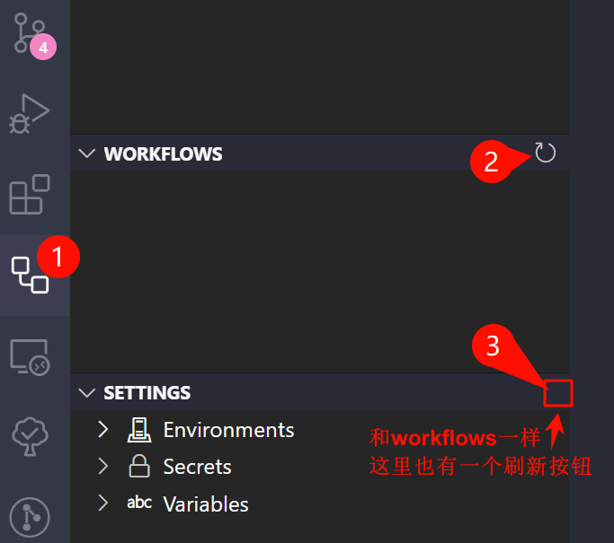

# 解决 安装了 VSCode 插件 Github Actions 后在.yml 文件中提示 name 无效: Value 'github-pages' is not valid

在安装了 VSCode 插件 Github Actions 后，自己在项目中 `.github/workflows`文件夹下新建 deploy.yml 文件，编辑 deploy.yml 的时候提示 name 字段 `github-pages` 无效: `Value 'github-pages' is not valid` ，经查阅，发现是插件 Github Actions 的问题，需要在插件中刷新一下。

## 报错信息

VSCode 报错提示：

```txt
Value 'github-pages' is not valid

The name of the environment used by the job.
Available expression contexts: github, inputs, vars, needs, strategy, matrix
```

## 问题解决

1. 打开 VSCode 的插件 Github Actions
2. 在 WORKFLOWS 中刷新
3. 如果第二步没有解决错误警告，就刷新 SETTINGS 中的刷新按钮

截图：

