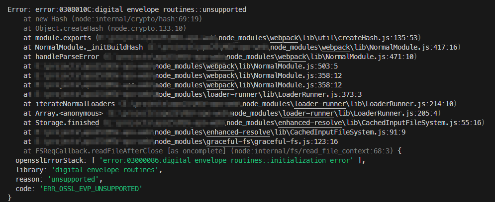

# 解决命令行报错error:0308010C:digital envelope routines::unsupported

## 问题描述

今天 npm run dev 起服务前端服务的时候，命令行报错，在这里记录一下：

截图如下



## 问题解决

主要原因的话就是node版本过高，由这两行报错可以看出来：

```bash

at new Hash (node:internal/crypto/hash:69:19)
    at Object.createHash (node:crypto:133:10)

```

就是说 在 node 内部的 crypto 库中hash.js文件使用 new Hash 时报的错误。这就时 node 内部问题

解决的话，需要切换到地版本的node，我报错的环境是node18。原因的话就是我用nvm 切换了node版本，使用nvm切换到低版本的 node 即可。

## 总结

本文解决了一个由 node 版本引发的 `npm run dev` 执行时发生命令行报错的问题，通过分析报错信息，找到解决方法，以后看到命令行终端中有类似`(node:internal/...)`的问题的时候可以优先考虑切换 node 版本。
​
