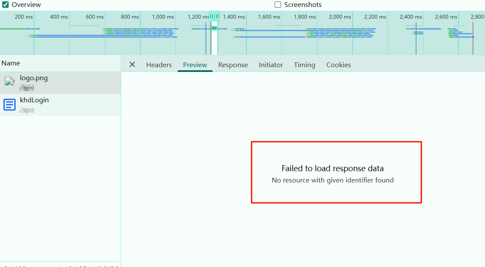
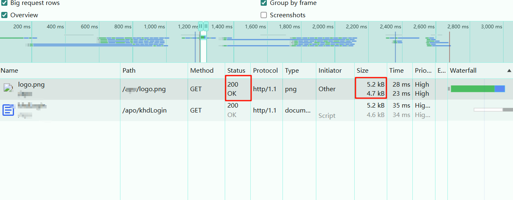

# 分析浏览器报错：Failed to load response data No resource with given identifier found

## 问题背景

这个报错是加载浏览器标签页 icon 图标的时候报的错误，正常情况下加载网页是加载成功的，但是我们项目是配置了单点登录页面的，不过部署到开发服配置的单点登录就是本站的地址，就是在浏览器跳转单点登录这个本站地址的时候报的这个错误。

页面是正常渲染的，logo 也能出来，控制台也没有报错。

## 原因分析

先解释一下这个报错语句：
> Failed to load response data
> No resource with given identifier found
> 意思就是：加载响应数据失败，没有找到给定的标识符的资源

一般来说如果加载图片，抛出给定的标识符相关的这个错误，差不多就是指文件访问路径和文件名，可以检查一下文件的访问路径对不对，或者文件名是否正确。

我去网上查了很多类似的，但是好像都和我的现象不太一样，他们都是有故障，比如百页之类的，我这个除了上面截图相关的错误之外，没有其他错误警告。

看了一下这个状态码200，和网络传输文件大小和源文件大小差不多大，都是正常的，应该说是加载成功了的

所以这个错误应该是浏览器的一些安全策略或者缓存解析策略导致的，因为毕竟我中间执行了一次跳转 url 的操作。

## 总结

本文主要记录了自己工作中遇到的浏览器执行单点登录跳转本域名时，浏览器加载解析图片的错误，分析了原因，如果有其他的解释请留言讨论。
