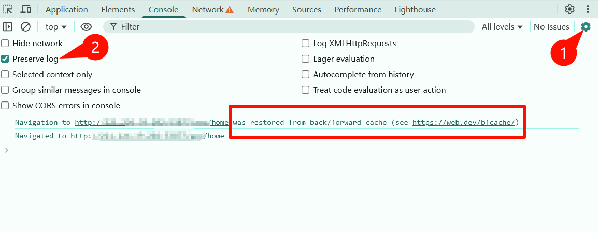

# 浏览器页面手动点击返回按钮，页面没有重新请求数据？很可能命中了bfcache

## 场景描述

Web 前端开发中算是比较常见的需求场景：

我们在当前页面通过接口更新了数据，并提交到了服务器，这个时候手动点击浏览器的返回按钮，会返回到历史页面。这时历史页面中展示的有些数据如果需要和刚刚提交到服务器的数据一致，那么就需要重新请求相关接口，来更新页面。

例如：购物车页面，时刻要保持最新的购物车数据，那么就需要在返回购物车页面时，重新请求购物车接口，来获取最新的数据。

但是问题是，页面会从浏览器的 back/forward cache 恢复，简称命中 bfcache，这是浏览器的默认行为，把所有的数据缓存起来，下次访问的时候，会恢复这些数据，因为这时数据没有重新请求，页面就不会更新。

浏览器的默认行为为什么要有 back/forward cache？其实目的是为了提升用户体验，特别是在网络慢的情况下，用户体验会更好，减少网络请求。详细了解的话，具体可以参考谷歌的这篇文章：[bfcache](https://web.dev/articles/bfcache)

这里需要注意的是，如果浏览器设置里面没有开启保留日志 preserve log，那么控制台中不会打印命中 bfcache 的日志。打开方式见下图：



那如何才能解决不让浏览器命中 bfcache 的问题呢？特别是不想缓存某些页面的时候。

## 解决方法

### 方法一：监听 pageshow 事件（推荐）

解决思路的话，其实就是主要利用一种前端思维，命中bfcache肯定是一个触发事件，刚好window上的 addEventListener 就可以监听各种事件，如果有一个事件可以刚好监听到，那么就可以解决这个问题。好巧不巧 pageshow 事件恰好可以监听到。

关于 pageshow 事件，[MDN](https://developer.mozilla.org/zh-CN/docs/Web/API/Window/pageshow_event) 上是这么介绍的：当一条会话历史记录被执行的时候将会触发页面显示 (pageshow) 事件。(这包括了后退/前进按钮操作，同时也会在 onload 事件触发后初始化页面时触发)

那么我们只要监听到 pageshow 事件，确定是页面被缓存了，然后刷新页面就行了。直接上代码：

```javascript
window.addEventListener('pageshow', function (event) { 
  if (event.persisted) {
    window.reload();
  }
})

// 页面退出的时候，取消监听器，请放在合适的时机执行，比如组件销毁的时候
window.removeEventListener('pageshow', function (event) { })
```

解释一下上面的代码：

`window.addEventListener('pageshow', function (event) { })` 监听 pageshow 事件，监听成功执行回调函数，event.persisted 表示页面是否被缓存，如果页面被缓存，则 event.persisted 为 true，否则为 false。

event.persisted 为 true 的时候，表示页面被缓存，此时调用 window.reload() 重新加载页面，重新请求接口，重新渲染页面。

最后在合适的时机取消监听事件，防止内存泄漏。

### 方法二：禁止缓存

响应头中添加 Cache-Control: no-store 禁止存储，如果设置了的话，浏览器将不会缓存页面到 bfcache中，注意：除非网站有一些敏感信息，需要一直保持最新的数据，否则不建议使用。

## 总结

本文介绍了页面返回命中 bfcache 页面数据不是最新的，没有刷新页面的解决方法，包括监听pageshow 事件和禁止缓存两种方法。希望对大家有所帮助。
