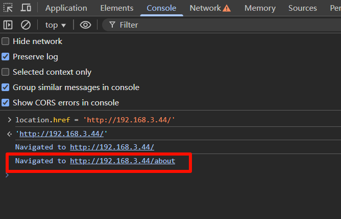
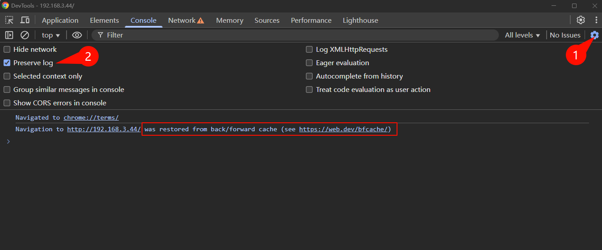

# 揭秘浏览器bfcache：为何点击返回按钮页面未重新加载？

## 场景描述

你是否遇到过这样的前端开发场景：

我们在网页上提交了表单或更新了数据，这个时候手动点击浏览器的返回按钮，会返回到历史页面，我们原本期望在历史页面看到最新的内容。

但是发现页面似乎“停滞”在过去？代码并没有重新执行？数据没有重新获取？这背后的原因很可能与一个叫做Back-Forward Cache（简称bfcache）的浏览器特性有关，这里为了保留严谨性使用了“可能”，毕竟本人开发经验有限，还在努力学习中哈哈。

其实我们返回的历史页面没有更新的原因是：页面会从浏览器的 bfcache 恢复，简称命中 bfcache，这是浏览器的默认行为，进入缓存时，会把所有的数据缓存起来，代码暂停执行，下次访问的时候，会恢复这些数据，并恢复代码执行，并不会重新请求数据，重新执行一遍代码，所以拿不到最新的数据。

浏览器的默认行为中，为什么要有 bfcache？其实目的其实是为了提升用户体验，特别是在网络慢的情况下，用户体验会更好,点击返回响应更快，减少网络请求，节省页面响应时间和网络资源。

那如何才能不让浏览器命中 bfcache 呢？特别是不想缓存某些网页的时候？

## 解决页面没有重新加载的方法

### 方法一：监听 pageshow 事件（推荐）

解决思路的话，其实就是主要利用一种前端思维，命中bfcache肯定是一个触发事件，刚好window上的 addEventListener 就可以监听各种事件，如果有一个事件可以刚好监听到，那么就可以解决这个问题。好巧不巧 pageshow 事件恰好可以监听到命中 bfcache 的事件。

关于 pageshow 事件，[MDN page-show](https://developer.mozilla.org/zh-CN/docs/Web/API/Window/pageshow_event) 上是这么介绍的：当一条会话历史记录被执行的时候将会触发页面显示 (pageshow) 事件。(这包括了后退/前进按钮操作，同时也会在 onload 事件触发后初始化页面时触发)

那么我们只要监听到 pageshow 事件，确定是页面被缓存了，然后刷新页面就行了。直接上代码：

```javascript
window.addEventListener('pageshow', function (event) { 
  if (event.persisted) {
    window.reload();
  }
})

// 页面退出的时候，取消监听器，请放在合适的时机执行，比如组件销毁的时候
window.removeEventListener('pageshow', function (event) { })
```

解释一下上面的代码：

`window.addEventListener('pageshow', function (event) { })` 监听 pageshow 事件，监听成功执行回调函数，event.persisted 表示页面是否被缓存，如果页面被缓存，则 event.persisted 为 true，否则为 false。

event.persisted 为 true 的时候，表示页面被缓存，此时调用 window\.reload() 就会强制重新加载页面，从而 重新请求接口，重新渲染页面。

最后我们在合适的时机调用`removeEventListener`，取消监听事件，防止内存泄漏。

### 方法二：禁止缓存(谨慎使用)

接口响应头中添加 Cache-Control: no-store 禁止存储，如果设置了的话，会导致浏览器的缓存失效，因为它禁止了任何形式的缓存存储。当然浏览器将不会缓存页面到 bfcache中

实操测试的话可以直接在 nginx 的配置文件nginx.conf中添加一行如下代码：

```patch
location / {
    root   html;
    index  index.html index.htm;
    try_files $uri $uri/ /index.html;
    # 临时测试 bfcache 用，缓存控制
+    add_header Cache-Control "no-store";
}
```

然后重启 nginx 服务，用浏览器隐身模式访问页面，可以在Console控制台手动修改location.href，先跳转到指定页面，再点击浏览器返回按钮，返回到之前的页面，就可以看到页面没有命中 bfcache，而是直接重新请求接口，重新渲染页面。


也可以使用下文中介绍的，浏览器自带的测试 bfcache 的方式。

> 注意：除非网站有一些敏感信息，需要一直保持最新的数据，否则不建议使用，而且可能有些场景使用 no-cache 或者 max-age=0 的缓存策略更合适。

## 浏览器中测试页面能否命中 bfcache

点击测试按钮`Test back/forward cache`，浏览器会先尝试把网页放入bfcache中，再从 bfcache 中取出来。如果成功了，则会在 Console 打印 bfcache 日志，如果成功中，则会列出原因，例如：

### 没命中的

设置了  Cache-Control: no-store 的页面：

给出的原因大致意思就是：网页资源有`cache-control: no-store`配置，无法进入 bfcache

### 命中的


## 浏览器没有打印 bfcache 日志的原因

有一些小伙伴可能遇到浏览器没有打印 bfcache 日志的问题，这里总结一下原因和解决办法：

### 浏览器没有配置保留日志

这里需要注意的是，如果浏览器设置里面没有开启保留日志 preserve log，那么控制台中不会打印命中 bfcache 的日志。打开方式见下图：



### SPA 的编程式路由导航不触发

如果页面是通过 pushState、replaceState或类似方法进行导航，则一般不会触发bfcache，因为这些操作通常意味着应用希望通过JavaScript自行管理其状态。

对于使用一般 SPA 应用，比如 Vue 中 通过router.push()、router.replace() 等方法进行导航，那么这些操作都会不触发 bfcache。

想在 SPA应用中测试触发 bfcache，可以向上面的方法一样，直接修改  location.href，然后点击浏览器的返回按钮，就可以看到页面命中 bfcache 的打印日志。

### 使用隐身模式

可能我们之前的网站使用了一些插件什么的，或者残余的有一些缓存，导致浏览器命中了bfcache，那么使用隐身模式打开页面，打开网络面板禁用缓存，强制刷新页面比如，Ctrl+F5。

## 总结

本文介绍了页面返回命中 bfcache 页面数据不是最新的，没有刷新页面的解决方法，包括监听pageshow 事件和禁止缓存两种方法，并总结了浏览器没有打印 bfcache 日志的原因和解决办法。对大家有所帮助的话可以动个发财的小手点个赞哟。更多文章请持续关注。

## 参考文章

MDN 中关于 bfcache 的介绍：[MDN bfcache](https://developer.mozilla.org/zh-CN/docs/Glossary/bfcache)

更详细地了解 bfcache 的话，可以参考谷歌的这篇文章：[Google bfcache](https://web.developers.google.cn/articles/bfcache?hl=zh-cn)
