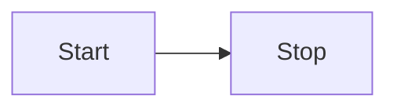

# 在 VitePress 中安装 mermaid 画 UML，并推荐在线 mermaid 编辑网址

[[toc]]

## 介绍

在 VitePress 中安装 Mermaid 需要安装一个插件，名字是 vitepress-plugin-mermaid。

[Github 地址](https://github.com/emersonbottero/vitepress-plugin-mermaid)

[插件使用文档](https://emersonbottero.github.io/vitepress-plugin-mermaid/)

## 插件安装

```bash
npm i vitepress-plugin-mermaid mermaid -D
```

## 导入配置

在.vitepress 文件夹下的 config.js 文件中编辑

```js
// .vitepress/config.js
import { defineConfig } from "vitepress";// [!code --]
import { withMermaid } from "vitepress-plugin-mermaid";// [!code ++]

export default defineConfig({// [!code --]
export default withMermaid({// [!code ++]
  // 你的原本配置
  // 可选地，可以传入MermaidConfig
  mermaid: {
    // 配置参考： https://mermaid.js.org/config/setup/modules/mermaidAPI.html#mermaidapi-configuration-defaults
  },
  // 可选地使用MermaidPluginConfig为插件本身设置额外的配置
  mermaidPlugin: {
    class: "mermaid my-class" // 为父容器设置额外的CSS类
  }
});
```

## 使用和 mermaid 在线编辑网址

直接在 markdown 文档中使用即可，语法规则见 [mermaid 文档](https://mermaid.js.org/intro/)

mermaid 在线编辑[地址](https://mermaid.live/)，可以一边编辑，一边实时预览

## 示例

### 流程图

示例一：

````mmd

````


示例二：

````mmd

````


### 类图

示例 1：

````mmd

````


示例二：

````mmd

````


### 饼图

````mmd

````


